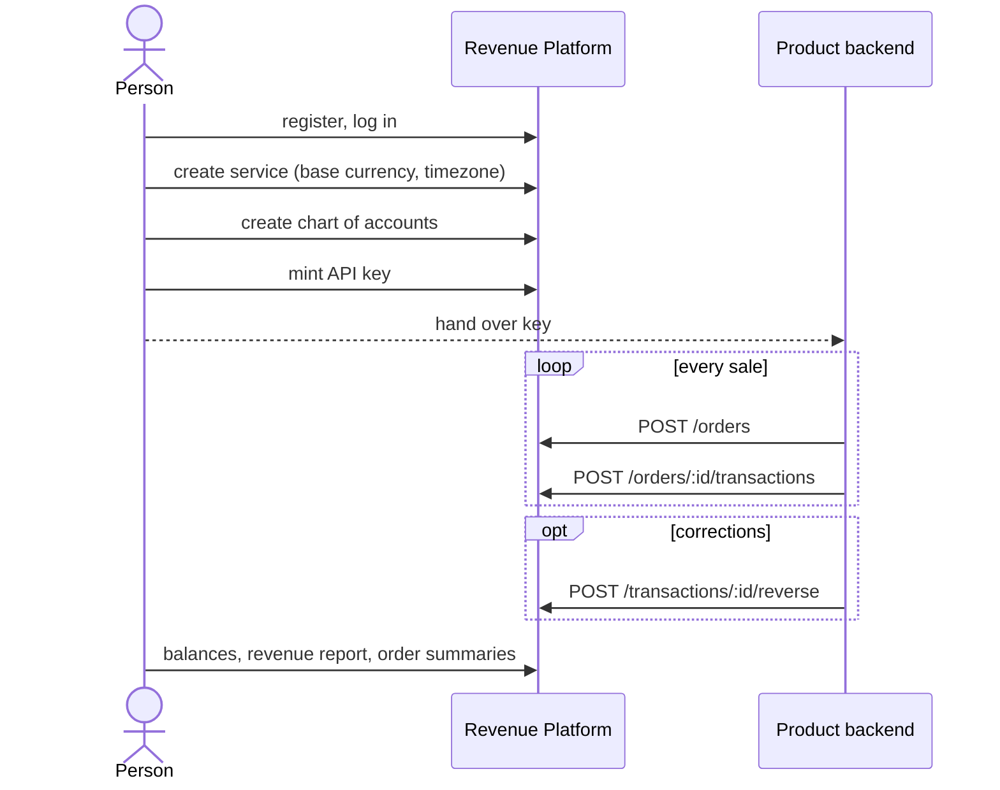

# User flow

How a product team goes from sign-up to revenue reports.

There are two actors:

| Actor | Who | Authenticates with |
|---|---|---|
| **Person** | someone on the product team | `Authorization: Bearer <access_token>` from `/auth/login` |
| **System** | the product's backend | `x-api-key: sk_live_…` minted for one service |

People set things up and read reports. Systems send orders and ledger
transactions.



Amounts are always whole **minor units** (kobo, cents): `350000` is ₦3,500.00.
They go in as numbers and come back as Money:
`{ "amount": "350000", "currency": "NGN" }`.

---

## 1. One-time setup (person)

### Register and log in

```http
POST /auth/register
{ "email": "ada@mtn.test", "password": "Password123!", "name": "Ada" }

POST /auth/login
{ "email": "ada@mtn.test", "password": "Password123!" }
→ 200 { "access_token": "eyJ…" }
```

Send the token as `Authorization: Bearer eyJ…` on every request below that
says *person*.

### Create a service

One service per product. Its **base currency** is what balances and reports
are shown in. Its **timezone** decides which day a sale counts toward. It is
optional and defaults to `Africa/Lagos`.

```http
POST /services
{ "name": "Data Bundles", "baseCurrency": "NGN", "timezone": "Africa/Lagos" }
→ 201 { "id": "svc_…", "slug": "data-bundles-1a2b3c4d", "baseCurrency": "NGN", "timezone": "Africa/Lagos", … }
```

### Build the chart of accounts

Every ledger entry posts to one of these. Codes are lowercase with
underscores and never change.

```http
POST /services/:serviceId/accounts
{ "code": "cash",           "name": "Cash received",  "type": "ASSET" }
{ "code": "vat_payable",    "name": "VAT payable",    "type": "LIABILITY" }
{ "code": "bundle_revenue", "name": "Bundle revenue", "type": "INCOME" }
{ "code": "payment_fees",   "name": "Payment fees",   "type": "EXPENSE" }
```

| Type | Grows with | Shows up in the revenue report |
|---|---|---|
| `ASSET`, `EXPENSE` | debits | no |
| `LIABILITY`, `EQUITY` | credits | no |
| `INCOME` | credits | **yes** |

### Mint an API key for the product's backend

```http
POST /services/:serviceId/keys
{ "name": "production" }
→ 201 { "id": "key_…", "key": "sk_live_…", "warning": "Copy this key now. It will not be shown again." }
```

The full key is shown **once**. After that only its prefix is listed. The
backend can check which service a key belongs to with `GET /services/whoami`.

---

## 2. Every sale (system)

### Send the order

```http
POST /orders                                    x-api-key: sk_live_…
{
  "externalId": "bundle-8812",
  "amount": 350000,
  "currency": "NGN",
  "placedAt": "2026-09-30T10:00:00.000Z",
  "description": "1GB data bundle",
  "customerRef": "+2348030001234",
  "metadata": { "channel": "ussd" }
}
→ 201 { "duplicate": false, "order": { "id": "ord_…", "total": { "amount": "350000", "currency": "NGN" }, … } }
```

`externalId` is the product's own ID for the order.

### Send the ledger transaction for it

This records what the sale did to the money. **Debits must equal credits
exactly**, otherwise the request is rejected with a 400.

```http
POST /orders/:orderId/transactions              x-api-key: sk_live_…
{
  "externalId": "bundle-8812-sale",
  "occurredAt": "2026-09-30T10:00:00.000Z",
  "description": "Bundle sale, VAT inclusive",
  "entries": [
    { "accountCode": "cash",           "direction": "DEBIT",  "amount": 350000 },
    { "accountCode": "vat_payable",    "direction": "CREDIT", "amount": 24419 },
    { "accountCode": "bundle_revenue", "direction": "CREDIT", "amount": 325581 }
  ]
}
→ 201 { "duplicate": false, "transaction": { "id": "txn_…", "entries": [ … ] } }
```

Each entry comes back with its `amount` (transaction currency) and its
`baseAmount` (service base currency).

**Paid in another currency?** Add the currency and the rate to base, with an
optional source for audit:

```json
{ "currency": "USD", "exchangeRate": "1550.25", "rateSource": "CBN official 2026-09-30", "entries": [ … ] }
```

### Retries are safe

| You send | You get |
|---|---|
| The identical order or transaction again | the original, with `duplicate: true`; nothing new is written |
| The same `externalId` with a different body | **422**: fix the client, don't overwrite |
| A transaction `externalId` already used on another order | **409** |

So on a timeout or a 5xx, resend the exact same request.

---

## 3. When things change (system)

| Situation | What to send |
|---|---|
| A transaction was wrong | `POST /transactions/:id/reverse { "externalId": "bundle-8812-sale-reversal" }` records the mirror image. Nothing is ever edited or deleted. Each transaction can be reversed once. |
| Partial refund | A new transaction against the same order for the refunded amount, e.g. debit `bundle_revenue` and `vat_payable`, credit `cash` |
| Money not tied to an order (fees, settlements) | `POST /transactions` with `"currency"` and the entries, plus an optional `orderId` |
| Has this order been fully booked? | `GET /orders/:id/summary` returns income recognised, `outstanding` and `fullyRecognised` |

Example fee:

```http
POST /transactions                              x-api-key: sk_live_…
{
  "externalId": "fee-2026-09-30",
  "occurredAt": "2026-09-30T18:00:00.000Z",
  "currency": "NGN",
  "entries": [
    { "accountCode": "payment_fees", "direction": "DEBIT",  "amount": 5000 },
    { "accountCode": "cash",         "direction": "CREDIT", "amount": 5000 }
  ]
}
```

---

## 4. Reporting (person)

| Question | Request |
|---|---|
| What does every account hold right now, or at a date? | `GET /services/:id/balances?asOf=2026-09-30` returns a trial balance in base currency. Debit and credit totals always match. |
| How much revenue did we make per day? | `GET /services/:id/reports/revenue?from=2026-09-01&to=2026-09-30` returns net income per local day and the total |
| Which orders came in? | `GET /services/:id/orders`, `GET /services/:id/orders/:orderId` |
| Is a given order fully booked? | `GET /services/:id/orders/:orderId/summary` |
| What's in the ledger? | `GET /services/:id/transactions`, `GET /services/:id/transactions/:txnId` |

Lists are cursor-paged: pass `?limit=` (max 100) and the `nextCursor` from
the previous page as `?cursor=`.

---

## 5. Housekeeping (person)

| Task | Request |
|---|---|
| Rename an account | `PATCH /services/:id/accounts/:code { "name": "Cash at bank" }` |
| Retire an account | `PATCH /services/:id/accounts/:code { "archived": true }`: new entries to it are refused, but reversals still work |
| Rotate a key | mint a new key, switch the backend over, then `DELETE /services/:id/keys/:keyId` on the old one |
| Delete a service | `DELETE /services/:id` (admins only) |

---

## Errors you'll see

| Status | Meaning |
|---|---|
| 400 | invalid body, unbalanced transaction, unknown or archived account, missing exchange rate |
| 401 | missing or invalid bearer token or API key |
| 403 | the service belongs to someone else, or the action needs ADMIN |
| 404 | no such order, transaction or account on this service |
| 409 | duplicate account code, `externalId` reused across orders, reversing twice |
| 422 | `externalId` reused with a different request body |

Every endpoint is also documented interactively at `/docs` once the server is
running. The Postman collection in `postman/` runs this whole flow top to
bottom.
